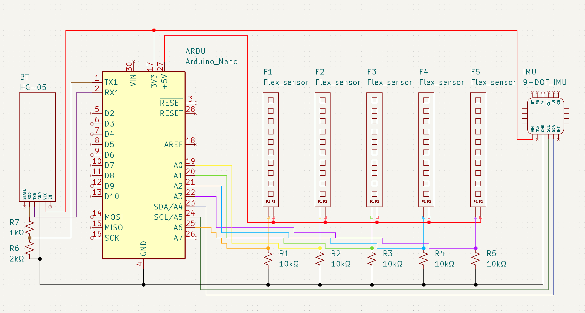
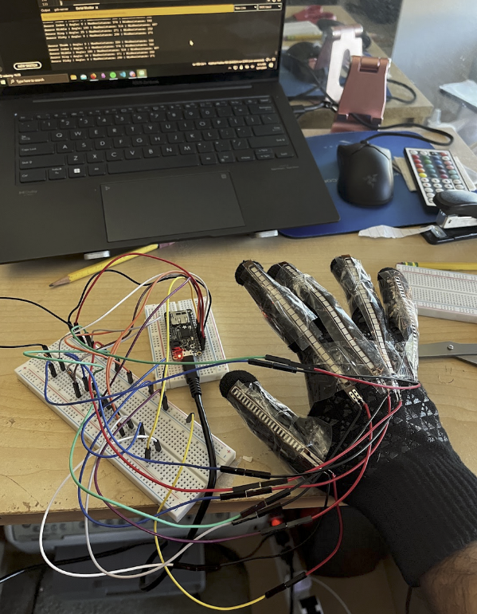
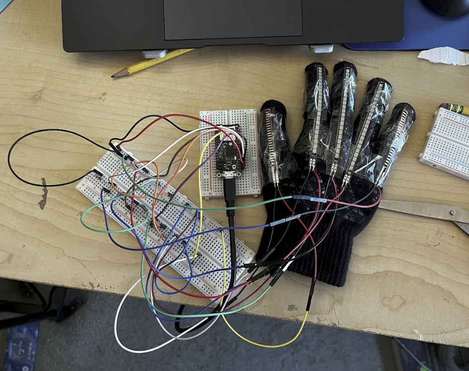

# Lexiglove 
Senior Engineering Capstone project at Bergen County Academies 2023-2024. The glove detects movement in the hands along with individual hand expression to translate ASL speech.

## Project Details
Five flex sensors are fastened to a glove. Each sensor is connected to a pulldown resistor (10kΩ) which is then connected to an Adafruit Feather M0 Adalogger. Schematic of circuit is attached below or can be found [here](https://imgur.com/B2mxhNx) (Note that circuit schematic uses an Arduino Nano. This was an older version of the circuit, but the main logic still stands. You can use any microcontroller as long as it is compatible with ArduinoIDE). The flex sensors are all connected to analog pins of the Feather, allowing the Feather to run the code. Output is seen in the serial monitor.

## Bill of Materials 
- [Adafruit Feather M0 Adalogger](https://www.adafruit.com/product/2796)
- [Adafruit 9-DOF IMU](https://www.adafruit.com/product/4646)
- [Flex sensors](https://www.adafruit.com/product/182) (10)
- [HC-05 Wireless Bluetooth Module](https://www.amazon.com/HiLetgo-Wireless-Bluetooth-Transceiver-Arduino/dp/B071YJG8DR)
- 10kΩ resistors (10)
- Breadboard
- Wires

## Future Modifications
The project currently is just a proof of concept, so many main features are not yet implemented. Some features that can be added include:
- Bluetooth and IMU compatibility
- Full alphabet and basic signs coded in
- Custom PCB design instead of breadboard for replication
- Two hand compatibility (second glove)
- Camera using machine learning to check facial expressions of wearer 
- Webapp that displays data to user 

## Final Notes
Images of project are attached below or can be found [here](https://imgur.com/UGn6dJl) and [here](https://imgur.com/2eNYeJY). If you have any questions feel free to contact me on discord/insta or shoot me an email at kangriwalaraj9@gmail.com

